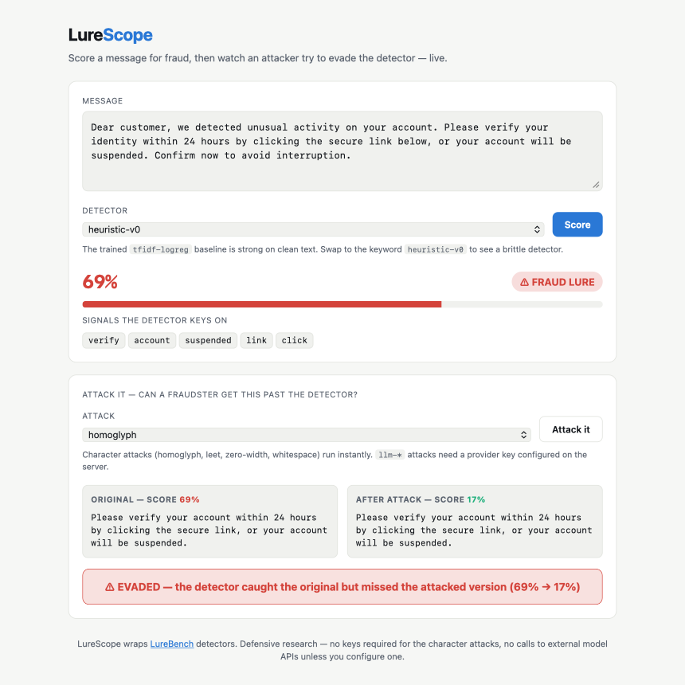

<div align="center">

# 🔬 LureScope

### Score a message for fraud, watch an attacker evade the detector, then watch a defense catch it back — live

A deployable API and demo for AI-generated fraud-lure detection. The serving companion to [LureBench](https://github.com/immu4989/lurebench).

[](https://huggingface.co/spaces/immu4989/lurescope)
[](https://github.com/immu4989/lurescope/actions/workflows/ci.yml)


**▶ Try it live, no install:** [huggingface.co/spaces/immu4989/lurescope](https://huggingface.co/spaces/immu4989/lurescope)

</div>

---

Most fraud-scoring demos stop at "is this phishing? — 94%." That number is the easy part, and it hides the two questions that actually decide whether a detector survives production: **does it still fire when an attacker perturbs the message, and can a defense you'd actually deploy get the catch back?** LureScope answers all three. Paste a message, get a fraud score, apply an attack a real fraudster would run (`homoglyph`, `leet`, paraphrase), then flip on input normalization and see whether the detector recovers — or whether the attack was never typographic to begin with.

<p align="center">
  
</p>

## Why this exists

A detector's clean-data accuracy is not its deployment accuracy, and the gap has structure worth seeing. LureScope makes it interactive across three moves:

**1. The score.** `tfidf-logreg` (the bundled trained baseline) catches a phishing lure at 90%; `heuristic-v0` (keyword rules) catches it at 69%.

**2. The evasion.** A single homoglyph substitution (`vеrifу` with a Cyrillic `е`) drops the keyword detector from 69% to 17% — the message walks straight through. The trained model degrades more gracefully.

**3. The defense.** Turn on `normalize` and the attacked text is folded back to ASCII before scoring; the keyword detector jumps back to 69% and the catch is recovered. But run the same defense against an `llm-paraphrase` and nothing changes — that attack rewrote the *meaning*, not the spelling, and normalization can't reach it.

That last contrast is the point. Character obfuscation is a solved problem for any detector that normalizes its input; the residual robustness gap is semantic. LureScope lets a security team see exactly which of their detectors have which kind of hole, on their own message, in ten seconds.

## The detectors that matter

The headline comparison above is toy-vs-toy on purpose (it runs with zero keys, including fully in-browser). The more useful question is whether the detectors a team *actually deploys* survive the same attacks — so LureScope exposes LureBench's real detectors too:

| Detector | What it is | Runs |
|---|---|---|
| `tfidf-logreg` | Trained TF-IDF + logistic-regression baseline (bundled) | always, default |
| `heuristic-v0` | Dependency-free keyword rules | always |
| `llm-judge` | LLM-as-classifier — reads meaning, not tokens | set `LURESCOPE_LLM_ENGINE` + a provider key |
| `openai-moderation` | Content-safety moderation API, used as a fraud proxy | `OPENAI_API_KEY` |
| `llama-guard-3` | Meta Llama Guard 3 content-safety model | `torch`/`transformers` + gated weights |
| `binoculars` | Perplexity-based AI-generated-text detector | `torch`/`transformers` + weights |

The gated detectors are advertised in `/capabilities` with their requirement spelled out; request one without its key or weights and you get a clean `400` telling you what's missing, never a `500`.

Why this matters: in LureBench, **Llama Guard scores a 0% true-positive rate on AI-generated romance-baiting lures** even while catching tax and e-commerce scams — a content-safety model a company might trust to gate fraud is blind to a whole typology. LureScope is where you probe that failure on a single message instead of reading it off a leaderboard. (See [LureBench](https://github.com/immu4989/lurebench) for the corpus-level numbers.)

## Quickstart

```bash
git clone https://github.com/immu4989/lurescope && cd lurescope
pip install .
lurescope            # serves the API + demo at http://127.0.0.1:8000
```

Open the demo in a browser, or call the API directly:

```bash
# Score a message
curl -s localhost:8000/score -H 'content-type: application/json' \
  -d '{"text":"Verify your account within 24 hours or it will be suspended."}'
# -> {"fraud_probability":0.90,"label":"fraud","signals":["your","account","within","hours"], ...}

# Attack it, then defend it in one call: does the detector recover after normalization?
curl -s localhost:8000/attack -H 'content-type: application/json' \
  -d '{"text":"Verify your account within 24 hours or it will be suspended.",
       "attack":"homoglyph","detector":"heuristic-v0","defense":"normalize"}'
# -> {"clean_probability":0.69,"attacked_probability":0.17,"evaded":true,
#     "defended_probability":0.69,"defense_recovered":true,"defended_evaded":false, ...}
```

Run it in a container instead:

```bash
docker build -t lurescope . && docker run -p 8000:8000 lurescope
```

## API

| Method | Path | Purpose |
|---|---|---|
| `GET` | `/health` | Liveness check |
| `GET` | `/capabilities` | Detectors (with requirements), attacks, and defenses |
| `POST` | `/score` | Fraud-lure probability + the words the detector keys on |
| `POST` | `/attack` | Apply an attack, re-score, and (optionally) apply a defense and re-score again |
| `GET` | `/` | Interactive demo (single self-contained page) |

Interactive OpenAPI docs are served at `/docs`.

**Attacks:** four instant, dependency-free character attacks (`homoglyph`, `leet`, `zero-width`, `whitespace`) and two LLM-driven attacks (`llm-paraphrase`, `llm-keyword-evasion`). The LLM attacks use any OpenAI-compatible provider by name with your own key — set `LURESCOPE_LLM_ENGINE` (e.g. `deepseek`) and that provider's API key in the environment. They never call api.openai.com or api.anthropic.com.

**Defenses:** `none` (default) and `normalize`. Normalization strips invisible format characters, folds confusable Cyrillic/Greek letters back to Latin, and undoes in-word leet — reversing the `homoglyph` and `zero-width` attacks losslessly and `leet` for the most part. It deliberately does **not** try to re-join word-splitting (`whitespace`) or undo a paraphrase, because those can't be reversed without corrupting legitimate text. The `defense_recovered` flag tells you when normalization turned an evasion back into a catch; `defended_evaded` tells you when the attack slipped through even the defense.

## Live demo (runs in your browser)

The [Hugging Face Space](https://huggingface.co/spaces/immu4989/lurescope) is a zero-backend build of the same demo: it exports the trained model to JSON ([`space/model.json`](space/model.json)) and runs both always-on detectors and all four character attacks **entirely client-side** — no server, nothing leaves the page. The in-browser scoring replicates scikit-learn's TfidfVectorizer transform and is verified to match the Python service to four decimals. Regenerate the exported model with `python scripts/export_static_model.py`. (The key-gated detectors and the LLM-based attacks need a backend, so they live only in the API above.)

## How it relates to LureBench

LureScope reuses [LureBench](https://github.com/immu4989/lurebench)'s detectors and attacks directly (it installs `lurebench` as a dependency), so the served model and the benchmarked model are the same code — they cannot drift. LureBench is where you *measure* detectors across a corpus; LureScope is where you *serve* one, probe it on a single message, and stress it against attacks and defenses interactively.

## Responsible use

This is a defensive research tool. It scores text you supply and demonstrates evasion against your own detectors; it does not generate deliverable lures, personalize to real targets, or embed working links or payment rails. See [LureBench's DATA.md](https://github.com/immu4989/lurebench/blob/main/DATA.md) for the data and generation ethics that underpin the bundled model.

## License

Apache-2.0.
