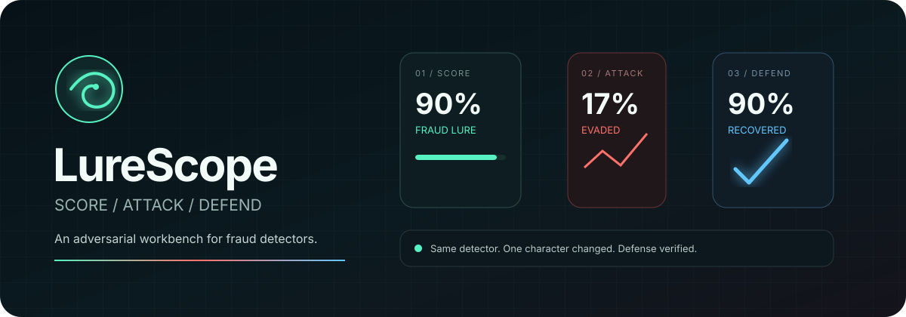

<div align="center">



### Break your fraud detector before an attacker does

Paste a message. Measure the score. Apply an evasion. Verify whether the defense recovers.

[](https://huggingface.co/spaces/immu4989/lurescope)
[](https://github.com/immu4989/lurescope/actions/workflows/ci.yml)


[](CODE_OF_CONDUCT.md)
[](https://doi.org/10.5281/zenodo.21631787)

**[Launch the live adversarial lab →](https://huggingface.co/spaces/immu4989/lurescope)**

</div>

---

Most fraud-scoring demos stop at "is this phishing? — 94%." That number is the easy part, and it hides the two questions that actually decide whether a detector survives production: **does it still fire when an attacker perturbs the message, and can a defense you'd actually deploy get the catch back?** LureScope answers all three. Paste a message, get a fraud score, apply an attack a real fraudster would run (`homoglyph`, `leet`, paraphrase), then flip on input normalization and see whether the detector recovers — or whether the attack was never typographic to begin with.

## LureProof: a portable resilience passport

Screenshots cannot be verified, vendor reports are difficult to compare, and
forwarding a suspicious email exposes its content. LureProof packages the useful
middle: **what a named control decided at a named threshold, whether four
adversarial edits evaded it, and whether normalization recovered the catch**—with
no raw body, subject, addresses, URLs, attachment names, or transformed lure text.

```bash
lurescope proof examples/suspicious-invoice.eml -o suspicious.lureproof.json
lurescope verify suspicious.lureproof.json
```

The JSON artifact has a recomputable integrity digest and an open schema. It can
travel with a SOC ticket, control-validation report, procurement exercise, or
cross-organization drill without carrying live lure content. Read the
[format, privacy boundary, standards landscape, and public-interest use cases](docs/LUREPROOF.md).

## Triage the artifact people actually receive

LureScope now accepts raw `.eml` files—not just copied text. It safely extracts
visible message content and reports model evidence alongside deterministic email
context: Reply-To mismatch, explicit SPF/DKIM/DMARC failures, punycode and
IP-address links, and risky attachment filename extensions.

```bash
# Human-readable result; everything runs locally by default
lurescope triage examples/suspicious-invoice.eml

# Help-desk queue → one structured JSON event per message
lurescope triage ./reported-emails --recursive --json > triage-results.jsonl
```

The API-backed browser lab served by `lurescope` has a **Choose .eml file**
workflow, and integrations can call `POST /triage/email`. LureScope never visits
extracted links or opens attachment contents. See
[real-world workflows and safety boundaries](docs/REAL_WORLD_USE_CASES.md).

| 01 · Score | 02 · Attack | 03 · Defend |
|:--|:--|:--|
| Establish the clean fraud signal and operating threshold. | Apply a deterministic or semantic evasion and measure the drop. | Normalize, re-score, and verify whether the catch is actually recovered. |

## Why this exists

A detector's clean-data accuracy is not its deployment accuracy, and the gap has structure worth seeing. LureScope makes it interactive across three moves:

**1. The score.** `tfidf-logreg` (the bundled trained baseline) catches a phishing lure at 90%; `heuristic-v0` (keyword rules) catches it at 69%.

**2. The evasion.** A single homoglyph substitution (`vеrifу` with a Cyrillic `е`) drops the keyword detector from 69% to 17% — the message walks straight through. The trained model degrades more gracefully.

**3. The defense.** Turn on `normalize` and the attacked text is folded back to ASCII before scoring; the keyword detector jumps back to 69% and the catch is recovered. But run the same defense against an `llm-paraphrase` and nothing changes — that attack rewrote the *meaning*, not the spelling, and normalization can't reach it.

That last contrast is the point. Character obfuscation is a solved problem for any detector that normalizes its input; the residual robustness gap is semantic. LureScope lets a security team see exactly which of their detectors have which kind of hole, on their own message, in ten seconds.

## Robustness scorecard

A single message is an anecdote; a rate over a corpus is a claim. Running both always-on detectors against every character attack on the 819 fraud lures in LureBench's `core/test` set gives the evasion rate — of the lures a detector caught clean, the fraction that slip below threshold after the attack — before and after the `normalize` defense:

<p align="center">
  
</p>

Read the pattern, not the cells. Normalization drives the `homoglyph` and `zero-width` columns to **0%** for both detectors because it reverses them losslessly; `leet` leaves a small residue (the `1`=`i`/`l` ambiguity); `whitespace` is untouched because re-joining split words would corrupt real text. The typographic gap closes, the semantic one does not. Full table in [SCORECARD.md](SCORECARD.md), background in the [writeup](blog/2026-07-23-robustness-gap-fraud-detection.md); regenerate on any corpus with:

```bash
python scripts/robustness_scorecard.py --data <corpus.jsonl> --out-md SCORECARD.md --out-png docs/assets/scorecard.png
```

## Cross-model: do LLM detectors survive?

The scorecard above uses two token detectors. The natural next question is whether an LLM-as-classifier — which reads meaning rather than tokens — survives the same attacks, and whether the semantic paraphrase is the attack that finally bites. Running the `llm-judge` detector across five models (via one OpenRouter key) over 120 fraud lures answers it:

<p align="center">
  
</p>

Three findings. First, the strong LLM judges are **essentially immune to character attacks** (0–5% evasion for the two strongest, where the keyword detector hits 100%): they read the meaning straight through the homoglyphs. Second, their clean recall here is below tfidf's 97% — but that turned out to be mostly a **threshold artifact**, not a capability gap (see the corrections below). Third, `paraphrase` is the attack that most erodes every judge: it is the worst column for four of the five, and the weakest judge (`qwen-2.5-7b`) is the most evadable at 29%.

> **Corrections.** Two published claims in this section have been revised; both are recorded in full in [LLM_SCORECARD.md](LLM_SCORECARD.md). In summary: **(2026-07-30)** the table's stated 120-lure sample was really 73 distinct records, because colliding record ids in the upstream corpus caused this script to overwrite records; judge recall was understated by 4–10 points and `deepseek-v4-flash` paraphrase evasion moved from 27% to 16%. **(2026-07-26).** This section originally read the judges' low clean recall as "immunity paid for in recall." Re-measured over the full 2,056-record `core/test` set with threshold-free metrics, the judges post an **AUC of 0.89–0.94** — they rank fraud above benign well, they are just badly calibrated at the 0.50 cut. Dropping `deepseek-v4-flash` to a 0.10 threshold lifts recall from 0.750 to 0.856 at a 2.5% false-positive rate. The character-attack immunity and the paraphrase weakness both stand; the recall trade-off does not. Details in [LLM_SCORECARD.md](LLM_SCORECARD.md), full leaderboard in [LureBench](https://github.com/immu4989/lurebench/blob/main/docs/leaderboard.md).

### Serve a validated decision policy

LureBench 0.9 can select a threshold on a validation split and export a policy
with its objective and validation-data digest. Point LureScope at that artifact:

```bash
export LURESCOPE_POLICY_PATH=/absolute/path/to/tfidf-1pct-fpr.json
uvicorn lurescope.app:app
```

When `/score` omits `threshold`, LureScope applies a configured policy whose
detector matches the request. The response includes `policy_id` and
`threshold_source=validated_policy`. An explicit request threshold remains a
supported override and is identified as `threshold_source=request`; with no
matching policy, the backward-compatible 0.5 default remains.

Full table and caveats in [LLM_SCORECARD.md](LLM_SCORECARD.md); reproduce with your own key and model list:

```bash
export OPENROUTER_API_KEY=...
python scripts/llm_scorecard.py --data <corpus.jsonl> --limit 120 \
  --out-md LLM_SCORECARD.md --out-png docs/assets/llm_scorecard.png
```

## The detectors that matter

The headline comparison above is toy-vs-toy on purpose (it runs with zero keys, including fully in-browser). The more useful question is whether the detectors a team *actually deploys* survive the same attacks — so LureScope exposes LureBench's real detectors too:

| Detector | What it is | Runs |
|---|---|---|
| `tfidf-logreg` | Trained TF-IDF + logistic-regression baseline (bundled) | always, default |
| `heuristic-v0` | Dependency-free keyword rules | always |
| `llm-judge` | LLM-as-classifier — reads meaning, not tokens | set `LURESCOPE_LLM_ENGINE` + a provider key |
| `openai-moderation` | Content-safety moderation API, used as a fraud proxy | `OPENAI_API_KEY` |
| `llama-guard-3` | Meta Llama Guard 3 content-safety model | `torch`/`transformers` + gated weights |
| `binoculars` | Perplexity-based AI-generated-text detector | `torch`/`transformers` + weights |

The gated detectors are advertised in `/capabilities` with their requirement spelled out; request one without its key or weights and you get a clean `400` telling you what's missing, never a `500`.

Why this matters: in LureBench, **Llama Guard scores a 0% true-positive rate on AI-generated romance-baiting lures** even while catching tax and e-commerce scams — a content-safety model a company might trust to gate fraud is blind to a whole typology. LureScope is where you probe that failure on a single message instead of reading it off a leaderboard. (See [LureBench](https://github.com/immu4989/lurebench) for the corpus-level numbers.)

## Quickstart

```bash
git clone https://github.com/immu4989/lurescope && cd lurescope
pip install .
lurescope            # serves the API + demo at http://127.0.0.1:8000
```

Open the demo in a browser, or call the API directly:

```bash
# Score a message
curl -s localhost:8000/score -H 'content-type: application/json' \
  -d '{"text":"Verify your account within 24 hours or it will be suspended."}'
# -> {"fraud_probability":0.90,"label":"fraud","signals":["your","account","within","hours"], ...}

# Attack it, then defend it in one call: does the detector recover after normalization?
curl -s localhost:8000/attack -H 'content-type: application/json' \
  -d '{"text":"Verify your account within 24 hours or it will be suspended.",
       "attack":"homoglyph","detector":"heuristic-v0","defense":"normalize"}'
# -> {"clean_probability":0.69,"attacked_probability":0.17,"evaded":true,
#     "defended_probability":0.69,"defense_recovered":true,"defended_evaded":false, ...}
```

Run it in a container instead:

```bash
docker build -t lurescope . && docker run -p 8000:8000 lurescope
```

## API

| Method | Path | Purpose |
|---|---|---|
| `GET` | `/health` | Liveness check |
| `GET` | `/capabilities` | Detectors (with requirements), attacks, and defenses |
| `POST` | `/score` | Fraud-lure probability + the words the detector keys on |
| `POST` | `/attack` | Apply an attack, re-score, and (optionally) apply a defense and re-score again |
| `POST` | `/triage/email` | Safely parse and triage a raw RFC 5322 email |
| `POST` | `/proof/email` | Create a privacy-minimized, verifiable resilience passport |
| `POST` | `/proof/verify` | Validate a LureProof structure and recompute its digest |
| `GET` | `/` | Interactive demo (single self-contained page) |

Interactive OpenAPI docs are served at `/docs`.

**Attacks:** four instant, dependency-free character attacks (`homoglyph`, `leet`, `zero-width`, `whitespace`) and two LLM-driven attacks (`llm-paraphrase`, `llm-keyword-evasion`). The LLM attacks use any OpenAI-compatible provider by name with your own key — set `LURESCOPE_LLM_ENGINE` (e.g. `deepseek`) and that provider's API key in the environment. They never call api.openai.com or api.anthropic.com.

**Defenses:** `none` (default) and `normalize`. Normalization strips invisible format characters, folds confusable Cyrillic/Greek letters back to Latin, and undoes in-word leet — reversing the `homoglyph` and `zero-width` attacks losslessly and `leet` for the most part. It deliberately does **not** try to re-join word-splitting (`whitespace`) or undo a paraphrase, because those can't be reversed without corrupting legitimate text. The `defense_recovered` flag tells you when normalization turned an evasion back into a catch; `defended_evaded` tells you when the attack slipped through even the defense.

## Live demo (runs in your browser)

The [Hugging Face Space](https://huggingface.co/spaces/immu4989/lurescope) is a zero-backend build of the same demo: it exports the trained model to JSON ([`space/model.json`](space/model.json)) and runs both always-on detectors and all four character attacks **entirely client-side** — no server, nothing leaves the page. The in-browser scoring replicates scikit-learn's TfidfVectorizer transform and is verified to match the Python service to four decimals. Regenerate the exported model with `python scripts/export_static_model.py`. (The key-gated detectors and the LLM-based attacks need a backend, so they live only in the API above.)

## How it relates to LureBench

LureScope reuses [LureBench](https://github.com/immu4989/lurebench)'s detectors and attacks directly (it installs `lurebench` as a dependency), so the served model and the benchmarked model are the same code — they cannot drift. LureBench is where you *measure* detectors across a corpus; LureScope is where you *serve* one, probe it on a single message, and stress it against attacks and defenses interactively.

## Responsible use

This is a defensive research tool. It scores text you supply and demonstrates evasion against your own detectors; it does not generate deliverable lures, personalize to real targets, or embed working links or payment rails. See [LureBench's DATA.md](https://github.com/immu4989/lurebench/blob/main/DATA.md) for the data and generation ethics that underpin the bundled model.

## Contributing

Contributions are welcome, especially new defenses and corrections to published
numbers. See [CONTRIBUTING.md](CONTRIBUTING.md) for the development setup and the
parity bar for the browser build, [CODE_OF_CONDUCT.md](CODE_OF_CONDUCT.md) for
community expectations, and [SECURITY.md](SECURITY.md) for what counts as a
vulnerability here (the attacks working is not one). Release history is in
[CHANGELOG.md](CHANGELOG.md).

## Citing

If you use LureScope in your work, see [CITATION.cff](CITATION.cff). Archived releases carry a DOI: cite the concept DOI [10.5281/zenodo.21631787](https://doi.org/10.5281/zenodo.21631787), which always resolves to the latest version.

## License

Apache-2.0.
