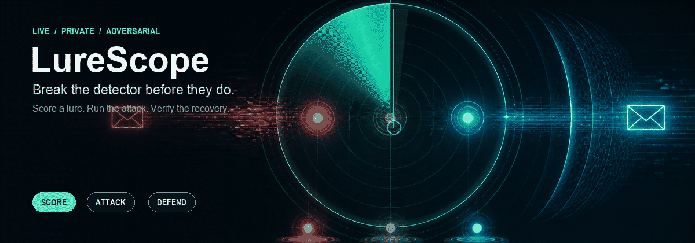
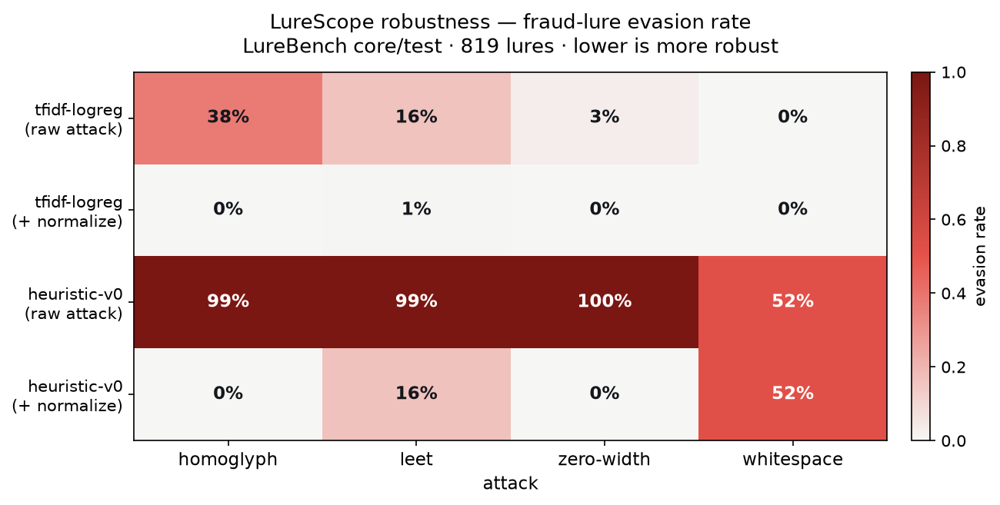
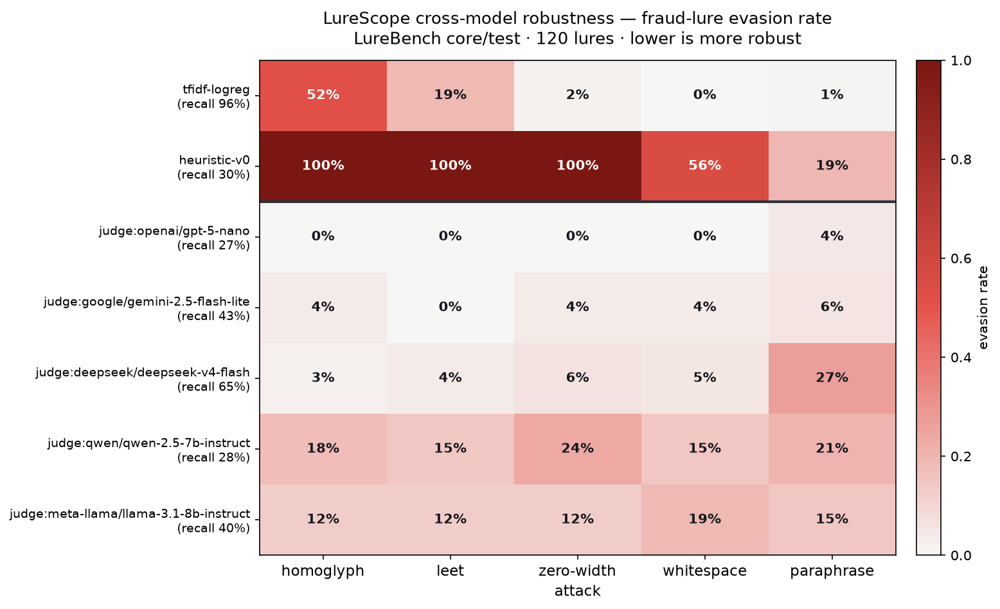

<div align="center">

<a href="https://immu4989.github.io/lurescope/"></a>

### Break your fraud detector before an attacker does

Paste a message. Measure the score. Apply an evasion. Verify whether the defense recovers.

[](https://immu4989.github.io/lurescope/)
[](https://huggingface.co/spaces/immu4989/lurescope)
[](https://github.com/immu4989/lurescope/actions/workflows/ci.yml)
[](https://github.com/immu4989/lurescope/actions/workflows/pypi-smoke.yml)
[](https://pypi.org/project/lurescope/)
[](https://github.com/immu4989/lurescope/pkgs/container/lurescope)


[](CODE_OF_CONDUCT.md)
[](https://doi.org/10.5281/zenodo.21631787)

**[Open private browser lab →](https://immu4989.github.io/lurescope/)** ·
**[Run full local API →](#quickstart)** ·
**[Run one-command operational pilot →](docs/OPERATIONAL_PILOT.md)** ·
**[Pilot an exported inbox →](#shadow-inbox-measure-before-enforcement)** ·
**[Compare Defender offline →](docs/MICROSOFT_DEFENDER_OFFLINE.md)** ·
**[Create a LureEval receipt →](docs/LUREEVAL.md)** ·
**[Explore evidence in-browser →](https://immu4989.github.io/lurescope/#evidence)** ·
**[Verify the Golden Pilot →](examples/shadow-pilot/README.md)** ·
**[Pre-register a Pilot Gate →](docs/PILOT_GATE.md)** ·
**[Export federal OSCAL evidence →](docs/FEDERAL_EMAIL_ASSURANCE.md)** ·
**[Bridge CISA SCuBA evidence →](docs/SCUBA_BRIDGE.md)** ·
**[Track signed assurance drift →](docs/SCUBA_DRIFT.md)** ·
**[Monitor deployment risk anytime →](docs/ANYTIME_MONITORING.md)** ·
**[View web UI source →](lurescope/static/index.html)**

</div>

---

```bash
python -m pip install lurescope
```

**New to LureScope?** Follow the
[five-minute reported-email workflow](docs/FIVE_MINUTE_WORKFLOW.md) from a saved
`.eml` to privacy-minimized LureProof and offline Splunk/Sentinel payloads.

Most fraud-scoring demos stop at "is this phishing? — 94%." That number is the easy part, and it hides the two questions that actually decide whether a detector survives production: **does it still fire when an attacker perturbs the message, and can a defense you'd actually deploy get the catch back?** LureScope answers all three. Paste a message, get a fraud score, apply an attack a real fraudster would run (`homoglyph`, `leet`, paraphrase), then flip on input normalization and see whether the detector recovers — or whether the attack was never typographic to begin with.

> **Deployment thresholds now carry inspectable evidence.** LureScope accepts
> LureBench schema-v2 policies with finite-sample FPR control, independently
> recomputes their exact statistics, and exposes assurance and limitations at
> `GET /policy`. See [risk-controlled policy deployment](docs/RISK_CONTROLLED_POLICY.md).

> **Private evidence can now travel without private email.** LureScope pairs an
> offline Microsoft Defender `EmailEvents` export with `.eml` evidence entirely in
> memory, produces signed LureEval operational receipts, and explains receipts,
> Pilot Gates, LureProof, and SCuBA statements in a no-upload browser Evidence
> Explorer. See the [Defender operator workflow](docs/MICROSOFT_DEFENDER_OFFLINE.md),
> [LureEval protocol](docs/LUREEVAL.md), and
> [browser verification boundary](docs/EVIDENCE_EXPLORER.md).

> **New — one install, one command, one cross-bound evidence bundle.**
> `lurescope pilot run --out ./lurescope-operational-pilot` exercises the
> reviewed synthetic workflow offline and atomically produces one exact Pilot
> Gate, an authenticated LureEval receipt, OSCAL 1.2.2 observations, and local
> Splunk, Sentinel, and OCSF exports. `lurescope pilot verify` rechecks every
> binding without rewriting evidence. Install `lurescope==0.11.0` and run it
> without a mailbox connection, API key, or network access. See the
> [operational pilot trust boundary](docs/OPERATIONAL_PILOT.md).

> **New in v0.11 — continuous monitoring without the peeking penalty.**
> [LureWatch](docs/ANYTIME_MONITORING.md) turns adjudicated aggregate FPR/FNR
> counts into an anytime-valid breach alarm. The detector, policy, risk limits,
> monitor family, and false-alarm budget are fixed first; every submitted batch
> is recomputed in a hash-chained in-toto checkpoint, with optional P-256 DSSE
> authentication. It stores no messages, case IDs, addresses, per-message scores,
> or per-message labels. No alarm is deliberately **not** called proof of safety.

Create an overall post-deployment monitor, then append one reviewed confusion
matrix. Exit status `1` is a successfully recorded breach signal, while `2`
means integrity or input validation failed:

```bash
lurescope monitor init --out ./agency-lurewatch \
  --plan-id agency-email-fraud-v1 \
  --fpr-limit 0.01 --fnr-limit 0.10 --family-alpha 0.05
lurescope monitor append ./agency-lurewatch --batch-id 2026-W35 \
  --true-positive 94 --false-negative 6 \
  --true-negative 298 --false-positive 2
lurescope monitor verify ./agency-lurewatch
```

## Shadow Inbox: measure before enforcement

Evaluate an exported `.eml` directory, Maildir, or mbox without connecting to a
mailbox or changing a message. Shadow Inbox deduplicates locally, creates minimized
LureProof cases, collects fixed-vocabulary analyst labels, and produces an
aggregate-only report of routing recall, false-positive rate, workload, and
adversarial weaknesses. Pilot Gate adds a pre-run statistical contract that cannot
pass with incomplete labels or inadequate evidence:

> Shadow Inbox, Pilot Gate, the Golden Pilot, Federal Email Assurance, SCuBA
> evidence/drift, Defender comparison, and LureEval ship in v0.9.0. Install the
> tagged package with `python -m pip install lurescope==0.9.0`.

Verify the complete synthetic workflow first—fixture integrity, ingestion,
deduplication, known ground truth, exact statistical gate, schemas, privacy scan,
private output permissions, signed LureEval, OSCAL, and SIEM exports—in one
offline, installable command:

```bash
python -m pip install "lurescope==0.11.0"
lurescope pilot run --out ./lurescope-operational-pilot
lurescope pilot verify ./lurescope-operational-pilot
```

Success ends with `OPERATIONAL PILOT CREATED: PASS` and writes a strict artifact
index. The tiny locked sample proves that the software path works; it is
explicitly not representative data, compliance evidence, or deployment evidence.
See the [evidence inventory and trust boundary](docs/OPERATIONAL_PILOT.md). The
source-only Golden Pilot remains available for regression compatibility in
[`scripts/run_golden_pilot.py`](scripts/run_golden_pilot.py).

For a manually reviewed synthetic exercise:

```bash
lurescope shadow plan --out ./pilot-plan.json --plan-id synthetic-pilot \
  --min-processed 5 --min-fraud-labels 1 --min-benign-labels 1 \
  --max-uncertain-rate 0 --max-failure-rate 0 \
  --min-recall-lower 0.05 --max-fpr-upper 0.99 \
  --max-routed-rate 1 --max-routed-count 5
lurescope shadow run examples/shadow-pilot/eml --threshold 0.5 --out ./shadow-pilot
# Repeat the fixed-vocabulary label command for every processed case.
# Replace this example with a case_id from manifest.jsonl.
lurescope shadow label ./shadow-pilot case-0123456789abcdef fraud \
  --reason confirmed_external
lurescope shadow report ./shadow-pilot
lurescope shadow gate ./shadow-pilot --plan ./pilot-plan.json
```

The tiny criteria above only exercise the synthetic workflow, and the gate will
correctly report `insufficient_evidence` until all five unique cases are labeled.
For a real pilot, pre-register organization-approved sample sizes and risk limits.
Pilot Gate binds the plan, minimized manifest, and label log; computes exact
one-sided recall/FPR bounds; checks review capacity; and returns
`insufficient_evidence`, `fail`, or `pass` with a
non-zero exit unless every registered criterion passes. See the
[statistical definitions, protocol, and interpretation limits](docs/PILOT_GATE.md).

### Compare Microsoft Defender offline on the same reviewed cohort

Export a bounded Microsoft Defender `EmailEvents` result and the corresponding
messages through your approved evidence process. LureScope joins Exchange or
Internet message IDs only in memory, then persists random case IDs and four fixed
native-attention signals—never subjects, addresses, recipients, tenant IDs,
message IDs, paths, URLs, attachment names, or content:

```bash
lurescope defender import ./EmailEvents.csv ./exported-eml \
  --recursive --threshold 0.5 --out ./defender-shadow-pilot

# Fixed-vocabulary adjudication refreshes both paired reports.
lurescope shadow label ./defender-shadow-pilot case-0123456789abcdef fraud \
  --reason confirmed_external
lurescope defender report ./defender-shadow-pilot --confidence 0.95
```

The aggregate report compares Defender attention and LureScope routing on exactly
the same matched, processed, fraud/benign-labeled messages, with exact one-sided
recall and FPR bounds. Unmatched, failed, uncertain, and unlabeled cases are
excluded and counted. Follow the
[offline Microsoft Defender workflow and decision rule](docs/MICROSOFT_DEFENDER_OFFLINE.md).

### Share field evidence without sharing messages

Once a reviewed bundle has a registered Pilot Gate, create a LureEval receipt:

```bash
lurescope lureeval create ./shadow-pilot \
  --sampling consecutive_sample --minimum-slice-count 20 \
  --issuer "Example SOC" --signing-key issuer.pem \
  --out site-a.lureeval.dsse.json

lurescope lureeval verify site-a.lureeval.dsse.json \
  --public-key issuer.pub.pem --require-signature
```

The receipt binds detector/policy bytes, cohort manifest, latest labels,
registered plan, and current gate; recomputes aggregate metrics; and suppresses
small slices. LureBench can authenticate and pool only compatible multi-site
receipts. Read the [trust model, commands, and non-guarantees](docs/LUREEVAL.md).

Prefer a visual explanation? Open the
[browser Evidence Explorer](https://immu4989.github.io/lurescope/#evidence) and
choose a JSON artifact. The file stays in the tab. The explorer intentionally
does not call a DSSE signature authenticated; trusted-key semantic verification
remains a CLI operation.

For an agency or supplier pilot, pre-register the same criteria together with a
portable identifier for the operator-controlled OSCAL System Security Plan, then
export aggregate NIST OSCAL 1.2.2 observations:

```bash
lurescope assurance init --out ./federal-email-plan \
  --plan-id agency-email-pilot \
  --ssp-href urn:uuid:11111111-1111-4111-8111-111111111111 \
  --min-processed 400 --min-fraud-labels 100 --min-benign-labels 300 \
  --max-uncertain-rate 0.02 --max-failure-rate 0.01 \
  --min-recall-lower 0.90 --max-fpr-upper 0.01 \
  --max-routed-rate 0.25 --max-routed-count 100
lurescope assurance export ./shadow-pilot --plan ./federal-email-plan
```

The export is network-free, aggregate-only, validated against official NIST OSCAL
schemas, and explicitly contains observations rather than compliance findings. It
does not create or validate an SSP, satisfy a control, grant an ATO, or authorize
enforcement. See the
[Federal Email Assurance Profile operator guide](docs/FEDERAL_EMAIL_ASSURANCE.md).

> **In v0.9.0:** the CISA SCuBA Evidence Bridge can
> combine that registered outcome evidence with a validated ScubaGear 1.8.x
> consolidated report. It emits minimized configuration observations, a combined
> OSCAL Assessment Results document, candidate-only OSCAL POA&M items for failing
> `Shall` controls, and an in-toto statement that binds every artifact. Raw provider
> settings, tenant identifiers, requirements, details, comments, and remediation
> annotations are excluded—but the remaining posture evidence is still sensitive.

```bash
lurescope assurance ingest-scuba ./ScubaResults_<UUID>.json \
  --bundle ./shadow-pilot --plan ./federal-email-plan \
  --out ./combined-email-assurance
lurescope assurance verify-scuba ./combined-email-assurance
```

The importer does not connect to Microsoft 365 or rerun SCuBA, and its candidate
POA&M records are not findings, accepted risks, deadlines, or authorization
decisions. Follow the [SCuBA Evidence Bridge operator guide](docs/SCUBA_BRIDGE.md).

### SCuBA Assurance Drift: detect posture change without retaining tenant data

The v0.9.0 offline Drift Ledger compares two
compatible Combined Email Assurance bundles and reports exactly what changed.
It refuses cross-release, cross-scope, cross-plan, or reverse-time comparisons;
classifies ambiguous result changes as `non_comparable`; and never calls an item
“remediated.” Each package includes minimized before/after snapshots, deterministic
JSON, Markdown and standalone HTML reports, OSCAL observations without findings,
an in-toto statement, and optional P-256 DSSE authentication.

```bash
lurescope assurance drift ./combined-before ./combined-after \
  --out ./assurance-drift --signing-key issuer.pem

lurescope assurance verify-drift ./assurance-drift \
  --public-key issuer.pub.pem --require-signature \
  --before ./combined-before --after ./combined-after
```

Extend an append-only history with `--previous-drift ./previous-entry`, then use
`verify-drift --previous-drift ... --require-chain` to check both the predecessor
statement digest and source continuity. The ledger supports continuous monitoring;
it does not satisfy an agency logging requirement or establish compliance. See the
[SCuBA Assurance Drift operator guide](docs/SCUBA_DRIFT.md).

Export reviewed, minimized records as OCSF 1.8 Detection Findings, ECS 9.4 NDJSON,
or a STIX 2.1 bundle—all without a network call:

```bash
lurescope export ./shadow-pilot/manifest.jsonl \
  --labels ./shadow-pilot/analyst-labels.jsonl \
  --format ocsf-1.8 --out ./shadow-pilot/ocsf.json
```

It never decodes QR images, opens attachments, follows links, quarantines mail, or
sends content to a model provider. Start with the
[synthetic pilot pack](examples/shadow-pilot/README.md), then follow the
[complete Shadow Inbox workflow, metric definitions, privacy boundary, and
standards mappings](docs/SHADOW_INBOX.md).

## Inbox to evidence in one command

Point LureScope at a folder of user-reported emails. It creates a private case
directory with one LureProof per message, a privacy-minimized JSONL manifest, and
an aggregate routing summary:

```bash
lurescope inbox ./reported-emails --recursive --out ./lurescope-cases

# Offline transforms—these commands never contact Splunk, Microsoft, or a webhook
lurescope export ./lurescope-cases/manifest.jsonl \
  --format splunk-hec --out ./lurescope-cases/splunk-hec.jsonl
lurescope export ./lurescope-cases/manifest.jsonl \
  --format sentinel --out ./lurescope-cases/sentinel.json
```

The shareable outputs contain random case IDs, scores, routing actions, evidence
codes, resilience counts, and proof digests. They do **not** contain source paths,
subjects, bodies, addresses, message IDs, URL values, or attachment names. Files
are created private and existing output directories are never overwritten. Add
`--signing-key issuer.pem` to authenticate every case as a DSSE envelope. See the
[complete Inbox-to-LureProof workflow and SIEM mappings](docs/INBOX_TO_LUREPROOF.md).

## LureProof: a portable resilience passport

Screenshots are difficult to authenticate, vendor reports are difficult to compare, and
forwarding a suspicious email exposes its content. LureProof packages the useful
middle: **what a named control decided at a named threshold, whether four
adversarial edits evaded it, and whether normalization recovered the catch**—with
no raw body, subject, addresses, URLs, attachment names, or transformed lure text.

```bash
# Unsigned evidence: strict and portable, but explicitly unauthenticated
lurescope proof examples/suspicious-invoice.eml -o suspicious.lureproof.json
lurescope verify suspicious.lureproof.json

# Authenticated evidence: in-toto Statement + standard DSSE envelope
lurescope keygen --private-out issuer.pem --public-out issuer.pub.pem
lurescope proof examples/suspicious-invoice.eml --signing-key issuer.pem \
  --issuer "Example SOC" --nonce "verifier-challenge-123" \
  -o suspicious.lureproof.dsse.json
lurescope verify suspicious.lureproof.dsse.json \
  --public-key issuer.pub.pem --require-signature
```

Prefer the browser? Run `lurescope`, open `http://127.0.0.1:8000`, choose a
saved `.eml`, review the triage result, and select **Download salted
LureProof**. The [API-backed web lab](lurescope/static/index.html) creates an
unsigned, strict proof through `POST /proof/email`; signing remains an explicit
offline CLI step.

The default uses a fresh salted subject commitment, preventing direct hash-based
matching between proofs; raw SHA-256 correlation is opt-in. Other fields can still
act as a fingerprint, so this is not an anonymity claim. Signed proofs bind
the exact payload and media type to an externally trusted P-256 key. They can
travel with a SOC ticket, control-validation report, procurement exercise, or
cross-organization drill without carrying live lure content. Read the
[format, privacy boundary, standards landscape, and public-interest use cases](docs/LUREPROOF.md).

## Triage the artifact people actually receive

LureScope now accepts raw `.eml` files—not just copied text. It safely extracts
visible message content and reports model evidence alongside deterministic email
context: Reply-To mismatch, explicit SPF/DKIM/DMARC failures, punycode and
IP-address links, risky attachment filename extensions, and bounded HTML cues for
QR/scan language or image-dominant messages. Image bytes are not decoded.

```bash
# Human-readable result; everything runs locally by default
lurescope triage examples/suspicious-invoice.eml

# Help-desk queue → one structured JSON event per message
lurescope triage ./reported-emails --recursive --json > triage-results.jsonl

# Full case bundle → minimized manifest + one LureProof per message
lurescope inbox ./reported-emails --recursive --out ./lurescope-cases
```

The API-backed browser lab served by `lurescope` has a **Choose .eml file**
workflow, and integrations can call `POST /triage/email`. LureScope never visits
extracted links or opens attachment contents. See
[real-world workflows and safety boundaries](docs/REAL_WORLD_USE_CASES.md).

| 01 · Score | 02 · Attack | 03 · Defend |
|:--|:--|:--|
| Establish the clean fraud signal and operating threshold. | Apply a deterministic or semantic evasion and measure the drop. | Normalize, re-score, and verify whether the catch is actually recovered. |

## Why this exists

A detector's clean-data accuracy is not its deployment accuracy, and the gap has structure worth seeing. LureScope makes it interactive across three moves:

**1. The score.** `tfidf-logreg` (the bundled trained baseline) catches a phishing lure at 90%; `heuristic-v0` (keyword rules) catches it at 69%.

**2. The evasion.** A single homoglyph substitution (`vеrifу` with a Cyrillic `е`) drops the keyword detector from 69% to 17% — the message walks straight through. The trained model degrades more gracefully.

**3. The defense.** Turn on `normalize` and the attacked text is folded back to ASCII before scoring; the keyword detector jumps back to 69% and the catch is recovered. But run the same defense against an `llm-paraphrase` and nothing changes — that attack rewrote the *meaning*, not the spelling, and normalization can't reach it.

That last contrast is the point. Character obfuscation is a solved problem for any detector that normalizes its input; the residual robustness gap is semantic. LureScope lets a security team see exactly which of their detectors have which kind of hole, on their own message, in ten seconds.

## Robustness scorecard

A single message is an anecdote; a rate over a corpus is a claim. Running both always-on detectors against every character attack on the 819 fraud lures in LureBench's `core/test` set gives the evasion rate — of the lures a detector caught clean, the fraction that slip below threshold after the attack — before and after the `normalize` defense:

<p align="center">
  
</p>

Read the pattern, not the cells. Normalization drives the `homoglyph` and `zero-width` columns to **0%** for both detectors because it reverses them losslessly; `leet` leaves a small residue (the `1`=`i`/`l` ambiguity); `whitespace` is untouched because re-joining split words would corrupt real text. The typographic gap closes, the semantic one does not. Full table in [SCORECARD.md](SCORECARD.md), background in the [writeup](blog/2026-07-23-robustness-gap-fraud-detection.md); regenerate on any corpus with:

```bash
python scripts/robustness_scorecard.py --data <corpus.jsonl> --out-md SCORECARD.md --out-png docs/assets/scorecard.png
```

## Cross-model: do LLM detectors survive?

The scorecard above uses two token detectors. The natural next question is whether an LLM-as-classifier — which reads meaning rather than tokens — survives the same attacks, and whether the semantic paraphrase is the attack that finally bites. Running the `llm-judge` detector across five models (via one OpenRouter key) over 120 fraud lures answers it:

<p align="center">
  
</p>

Three findings. First, the strong LLM judges are **essentially immune to character attacks** (0–5% evasion for the two strongest, where the keyword detector hits 100%): they read the meaning straight through the homoglyphs. Second, their clean recall here is below tfidf's 97% — but that turned out to be mostly a **threshold artifact**, not a capability gap (see the corrections below). Third, `paraphrase` is the attack that most erodes every judge: it is the worst column for four of the five, and the weakest judge (`qwen-2.5-7b`) is the most evadable at 29%.

> **Corrections.** Two published claims in this section have been revised; both are recorded in full in [LLM_SCORECARD.md](LLM_SCORECARD.md). In summary: **(2026-07-30)** the table's stated 120-lure sample was really 73 distinct records, because colliding record ids in the upstream corpus caused this script to overwrite records; judge recall was understated by 4–10 points and `deepseek-v4-flash` paraphrase evasion moved from 27% to 16%. **(2026-07-26).** This section originally read the judges' low clean recall as "immunity paid for in recall." Re-measured over the full 2,056-record `core/test` set with threshold-free metrics, the judges post an **AUC of 0.89–0.94** — they rank fraud above benign well, they are just badly calibrated at the 0.50 cut. Dropping `deepseek-v4-flash` to a 0.10 threshold lifts recall from 0.750 to 0.856 at a 2.5% false-positive rate. The character-attack immunity and the paraphrase weakness both stand; the recall trade-off does not. Details in [LLM_SCORECARD.md](LLM_SCORECARD.md), full leaderboard in [LureBench](https://github.com/immu4989/lurebench/blob/main/docs/leaderboard.md).

### Serve a risk-controlled decision policy

LureBench can now require finite-sample evidence—not merely an observed
validation FPR—before exporting a threshold:

```bash
lurebench calibrate -d validation.jsonl -m tfidf-logreg \
  --model-path models/tfidf-logreg-fraud.joblib \
  --objective risk_controlled_fpr --target-fpr 0.01 \
  --confidence 0.95 -o policies/tfidf-1pct-fpr-95.json
lurescope policy policies/tfidf-1pct-fpr-95.json
export LURESCOPE_POLICY_PATH=/absolute/path/to/policies/tfidf-1pct-fpr-95.json
uvicorn lurescope.app:app
```

When `/score` omits `threshold`, LureScope applies a configured policy whose
detector matches the request. The response includes `policy_id` and
`threshold_source=validated_policy`. An explicit request threshold remains a
supported override and is identified as `threshold_source=request`; with no
matching policy, the backward-compatible 0.5 default remains.
`GET /policy` reports whether the configured artifact is finite-sample
risk-controlled, empirical-only, or absent, along with its assumptions. Details
in the [deployment guide](docs/RISK_CONTROLLED_POLICY.md).

Full table and caveats in [LLM_SCORECARD.md](LLM_SCORECARD.md); reproduce with your own key and model list:

```bash
export OPENROUTER_API_KEY=...
python scripts/llm_scorecard.py --data <corpus.jsonl> --limit 120 \
  --out-md LLM_SCORECARD.md --out-png docs/assets/llm_scorecard.png
```

## The detectors that matter

The headline comparison above is toy-vs-toy on purpose (it runs with zero keys, including fully in-browser). The more useful question is whether the detectors a team *actually deploys* survive the same attacks — so LureScope exposes LureBench's real detectors too:

| Detector | What it is | Runs |
|---|---|---|
| `tfidf-logreg` | Trained TF-IDF + logistic-regression baseline (bundled) | always, default |
| `heuristic-v0` | Dependency-free keyword rules | always |
| `llm-judge` | LLM-as-classifier — reads meaning, not tokens | set `LURESCOPE_LLM_ENGINE` + a provider key |
| `openai-moderation` | Content-safety moderation API, used as a fraud proxy | `OPENAI_API_KEY` |
| `llama-guard-3` | Meta Llama Guard 3 content-safety model | `torch`/`transformers` + gated weights |
| `binoculars` | Perplexity-based AI-generated-text detector | `torch`/`transformers` + weights |

The gated detectors are advertised in `/capabilities` with their requirement spelled out; request one without its key or weights and you get a clean `400` telling you what's missing, never a `500`.

Why this matters: in LureBench, **Llama Guard scores a 0% true-positive rate on AI-generated romance-baiting lures** even while catching tax and e-commerce scams — a content-safety model a company might trust to gate fraud is blind to a whole typology. LureScope is where you probe that failure on a single message instead of reading it off a leaderboard. (See [LureBench](https://github.com/immu4989/lurebench) for the corpus-level numbers.)

## Quickstart

```bash
python3 -m venv .venv
source .venv/bin/activate
python -m pip install lurescope
lurescope
```

For a contributor checkout, clone the repository and install the development
extras with `python -m pip install -e ".[dev]"`.

Keep that terminal running, then open the
**[full local web lab](http://127.0.0.1:8000)**. The local HTML page is
API-backed, so opening `lurescope/static/index.html` directly with a `file://`
URL will display the interface but its scoring, triage, and proof actions will
not work. Alternatively, use the
**[public browser-only demo](https://huggingface.co/spaces/immu4989/lurescope)**
without installing anything.

You can also call the local API directly:

```bash
# Score a message
curl -s localhost:8000/score -H 'content-type: application/json' \
  -d '{"text":"Verify your account within 24 hours or it will be suspended."}'
# -> {"fraud_probability":0.90,"label":"fraud","signals":["your","account","within","hours"], ...}

# Attack it, then defend it in one call: does the detector recover after normalization?
curl -s localhost:8000/attack -H 'content-type: application/json' \
  -d '{"text":"Verify your account within 24 hours or it will be suspended.",
       "attack":"homoglyph","detector":"heuristic-v0","defense":"normalize"}'
# -> {"clean_probability":0.69,"attacked_probability":0.17,"evaded":true,
#     "defended_probability":0.69,"defense_recovered":true,"defended_evaded":false, ...}
```

Run it in a hardened local container instead:

```bash
docker pull ghcr.io/immu4989/lurescope:0.11.0
docker run --name lurescope-local --restart unless-stopped \
  --read-only --tmpfs /tmp:rw,noexec,nosuid,size=64m \
  --cap-drop ALL --security-opt no-new-privileges:true \
  -p 127.0.0.1:8000:8000 \
  -e LURESCOPE_LLM_ENGINE=openrouter -e OPENROUTER_API_KEY \
  ghcr.io/immu4989/lurescope:0.11.0
```

The public image supports `linux/amd64` and `linux/arm64` and carries SBOM and
provenance attestations. Its runtime is non-root, contains no Git or compiler
toolchain, carries a Docker health check, and pins the exact LureBench source
used by its policy verifier. To build it yourself, replace the pull with
`docker build -t lurescope .` and use `lurescope` as the final run argument.
Keep key-backed deployments on localhost unless an authenticating, rate-limiting
gateway is in front; otherwise public callers can spend your provider credits.

For a guarded deployment with authentication, rate limiting, provider spending
disabled, immutable image digest, read-only filesystem, dropped capabilities,
and bounded resources, use the checked-in [`compose.yaml`](compose.yaml) and the
[secure Compose procedure](docs/PUBLIC_DEPLOYMENT.md#secure-docker-compose).

For an internet-facing deployment, enable LureScope's fail-closed public mode.
It requires a bearer key, rate-limits each credential, defaults to local
detectors, blocks arbitrary provider/model selection, and keeps provider use at
a zero-call budget until explicitly enabled. Follow the
[public deployment guardrails](docs/PUBLIC_DEPLOYMENT.md) and inspect the active
posture at `GET /security`.

## API

| Method | Path | Purpose |
|---|---|---|
| `GET` | `/health` | Liveness check |
| `GET` | `/capabilities` | Detectors (with requirements), attacks, and defenses |
| `GET` | `/policy` | Configured threshold, provenance, assurance evidence, and limitations |
| `GET` | `/security` | Non-secret authentication, rate-limit, allowlist, and provider-budget posture |
| `POST` | `/score` | Fraud-lure probability + the words the detector keys on |
| `POST` | `/attack` | Apply an attack, re-score, and (optionally) apply a defense and re-score again |
| `POST` | `/triage/email` | Safely parse and triage a raw RFC 5322 email |
| `POST` | `/proof/email` | Create a strict, privacy-minimized unsigned statement |
| `POST` | `/proof/verify` | Validate a statement or authenticate a signed DSSE envelope |
| `GET` | `/` | Interactive demo (single self-contained page) |

Interactive OpenAPI docs are served at `/docs`.

**Attacks:** four instant, dependency-free character attacks (`homoglyph`, `leet`, `zero-width`, `whitespace`) and two LLM-driven attacks (`llm-paraphrase`, `llm-keyword-evasion`). The LLM attacks use any OpenAI-compatible provider by name with your own key — set `LURESCOPE_LLM_ENGINE` (e.g. `deepseek`) and that provider's API key in the environment. They never call api.openai.com or api.anthropic.com.

**Defenses:** `none` (default) and `normalize`. Normalization strips invisible format characters, folds confusable Cyrillic/Greek letters back to Latin, and undoes in-word leet — reversing the `homoglyph` and `zero-width` attacks losslessly and `leet` for the most part. It deliberately does **not** try to re-join word-splitting (`whitespace`) or undo a paraphrase, because those can't be reversed without corrupting legitimate text. The `defense_recovered` flag tells you when normalization turned an evasion back into a catch; `defended_evaded` tells you when the attack slipped through even the defense.

## Live demo (runs in your browser)

The [Hugging Face Space](https://huggingface.co/spaces/immu4989/lurescope) is a zero-backend build of the same demo: it exports the trained model to JSON ([`space/model.json`](space/model.json)) and runs both always-on detectors and all four character attacks **entirely client-side** — no server, nothing leaves the page. The in-browser scoring replicates scikit-learn's TfidfVectorizer transform and is verified to match the Python service to four decimals. Regenerate the exported model with `python scripts/export_static_model.py`. (The key-gated detectors and the LLM-based attacks need a backend, so they live only in the API above.)

## How it relates to LureBench

LureScope reuses [LureBench](https://github.com/immu4989/lurebench)'s detectors and attacks directly (it installs `lurebench` as a dependency), so the served model and the benchmarked model are the same code — they cannot drift. LureBench is where you *measure* detectors across a corpus; LureScope is where you *serve* one, probe it on a single message, and stress it against attacks and defenses interactively.

## Responsible use

This is a defensive research tool. It scores text you supply and demonstrates evasion against your own detectors; it does not generate deliverable lures, personalize to real targets, or embed working links or payment rails. See [LureBench's DATA.md](https://github.com/immu4989/lurebench/blob/main/DATA.md) for the data and generation ethics that underpin the bundled model.

## Contributing

Contributions are welcome, especially new defenses and corrections to published
numbers. See [CONTRIBUTING.md](CONTRIBUTING.md) for the development setup and the
parity bar for the browser build, [CODE_OF_CONDUCT.md](CODE_OF_CONDUCT.md) for
community expectations, and [SECURITY.md](SECURITY.md) for what counts as a
vulnerability here (the attacks working is not one). Release history is in
[CHANGELOG.md](CHANGELOG.md).

## Citing

If you use LureScope in your work, see [CITATION.cff](CITATION.cff). Archived releases carry a DOI: cite the concept DOI [10.5281/zenodo.21631787](https://doi.org/10.5281/zenodo.21631787), which always resolves to the latest version.

## License

Apache-2.0.
