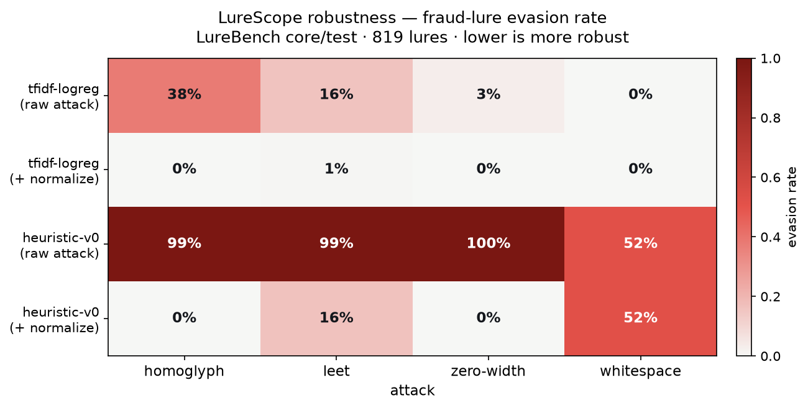

A fraud-lure detector that scores 96% recall on clean text looks production-ready. Then someone swaps the Latin `e` in "verify" for the Cyrillic `е`, and the same message slips under the threshold. Nothing about the content changed. The classifier just never saw that token.

This is the gap between clean-data accuracy and deployment accuracy, and most demos hide it. I built [LureScope](https://github.com/immu4989/lurescope) to make it measurable and interactive. You paste a message, get a fraud score, apply an attack a real fraudster would run, and then apply a defense and watch whether the detector recovers. It is the serving companion to [LureBench](https://github.com/immu4989/lurebench), my fraud-lure detection benchmark, and it reuses LureBench's detectors and attacks directly so the served model and the benchmarked model are the same code.

## The robustness scorecard

A single message is an anecdote. To make a claim you need a rate over a corpus. Running both always-on detectors against every character attack over the 819 fraud lures in LureBench's core test set gives the evasion rate: of the lures a detector caught on clean text, the fraction that drop below threshold after the attack.



| Detector | Clean recall | homoglyph | leet | zero-width | whitespace |
|---|---|---|---|---|---|
| `tfidf-logreg` | 96% | 38% → 0% | 16% → 1% | 3% → 0% | 0% → 0% |
| `heuristic-v0` | 21% | 99% → 0% | 99% → 16% | 100% → 0% | 52% → 52% |

The arrow is the defense: raw evasion, then evasion after input normalization folds the text back to ASCII. Read the pattern rather than the individual cells. Normalization drives the homoglyph and zero-width columns to zero for both detectors, because those attacks are reversible without loss. It leaves a 16% residue on leet, where the digit `1` is ambiguous between `i` and `l` and cannot always be undone. It does nothing at all for whitespace splitting, because re-joining "ve rify" would also merge legitimately separate words.

That last column is the honest part. The typographic gap closes cleanly; the semantic gap does not. A paraphrase that rewrites the meaning rather than the spelling walks straight through normalization, and no amount of character folding will catch it. If you deploy a detector and normalize its input, you have solved the easy half of the robustness problem and should stop worrying about it. The half that remains is semantic, and it is the one worth your attention.

The whole table is reproducible on any corpus:

```bash
pip install "git+https://github.com/immu4989/lurescope.git[viz]"
python scripts/robustness_scorecard.py --data <corpus.jsonl> \
  --out-md SCORECARD.md --out-png docs/assets/scorecard.png
```

## Where content-safety models fail entirely

The scorecard above covers a trained baseline and a keyword detector. The more uncomfortable result comes from the models teams actually reach for. In LureBench, Meta's Llama Guard scores a 0% true-positive rate on AI-generated romance-baiting lures, even while it catches tax and e-commerce scams. A content-safety model that a company might trust to gate fraud is blind to an entire typology. LureScope exposes these detectors (Llama Guard, OpenAI moderation, an LLM-as-classifier) behind the same API, so you can probe that failure on your own message instead of reading it off a leaderboard.

## Try it

The demo runs entirely in your browser with no install and no data leaving the page: [huggingface.co/spaces/immu4989/lurescope](https://huggingface.co/spaces/immu4989/lurescope). Source, the full API, and the scorecard script are on GitHub: [github.com/immu4989/lurescope](https://github.com/immu4989/lurescope).

None of the individual attacks are novel. The contribution is making the robustness gap reproducible, and showing exactly where a defense helps and where it quietly does not.
